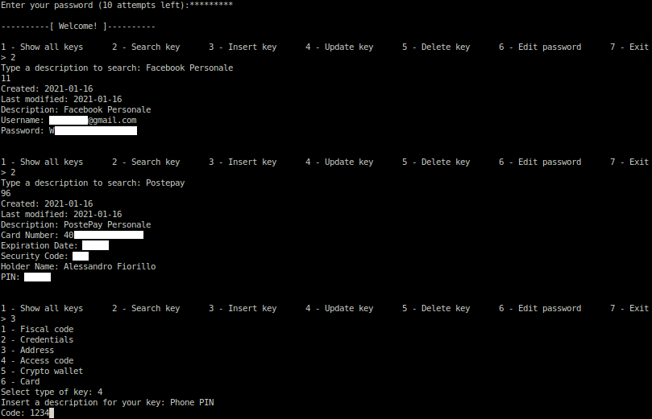

# Password Manager

A simple software to store your passwords in a safe place. You don't need to remember dozens of passwords anymore: just remember a single password to rule them all!

This program is written in Java and it is accessible through an interactive command-line interface. You can use it to store different kinds of sensitive data: not only passwords for online services, but also data of credit cards, private keys of Bitcoin wallets and simple access codes, such as the PIN of your SIM.



The application is packed in a JAR file and you can directly run it by typing ```java -jar "Password Manager.jar"```.

Advice and contributions are always welcome!

